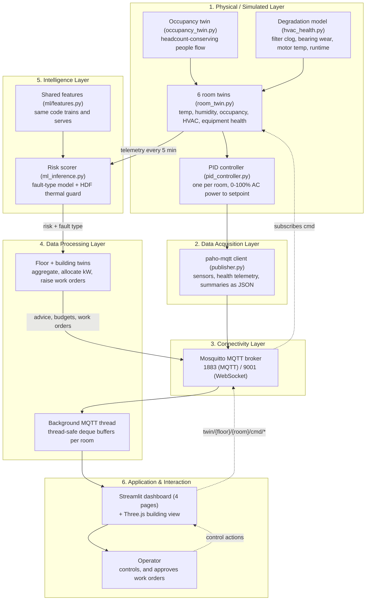

# Smart Facility Digital Twin — Architecture

Design, components and data flows.

> **Scope note.** This document covers the *layered* architecture and the
> control theory, both of which carry over from Project 1 unchanged. The
> multi-twin coordination model — how eleven twins interact, and why federated
> rather than centralised — is in [ecosystem.md](ecosystem.md). Governance and
> security are in [governance.md](governance.md).

## What changed in Project 2

| | Project 1 | Project 2 |
|---|---|---|
| Scope | 1 room (`twin/room1`) | 2 floors, 6 rooms, 11 twins |
| Topics | `twin/room1/*` | `twin/{floor}/{room}/*` — Project-1 topics retired |
| Coordination | None | Federated: floor and building twins advise, rooms decide |
| Occupancy | Per-room random walk | Headcount-conserving people flow between rooms |
| Equipment | Perfect, never degrades | Fan-motor and filter degradation calibrated to UCI AI4I 2020 |
| Intelligence | PID control only | PID **plus** a fault-type model and a thermal guard |
| Integrator | Explicit Euler | Implicit Euler — the explicit form was unstable at large timesteps |
| Dashboard | Single page | Four pages over one cached MQTT client |

The PID controller, the MQTT rationale and the twin-vs-shadow argument below are
all Project 1's and remain valid; Project 2 layers on top of them.

---

## 6-Layer Architecture Diagram



The intelligence layer is new in Project 2 and sits **beside** the control path,
not inside it: a failed model degrades risk reporting but cannot stop cooling.

---

## Technical Design & Strategy

### Why MQTT instead of Static CSV or REST Polling?
A real-time Digital Twin requires bidirectional event-driven communication. 
* **Decoupling**: The Simulator runs independently of who is listening. Both the Streamlit dashboard and the Three.js 3D viewport (running directly in the user's browser) subscribe to the same MQTT topics without imposing extra load on the simulator.
* **Low Latency & Overhead**: MQTT headers are lightweight (2 bytes), optimal for continuous telemetry.
* **LWT (Last Will and Testament)**: Enables the broker to publish an `offline` message if the simulator crashes or disconnects unexpectedly, notifying the dashboard instantly.
* **Retained Messages**: Newly connected clients (like a reopened browser page) instantly receive the latest state (temperature, occupancy, AC power) rather than waiting for the next publishing interval.

### Digital Twin vs. Digital Shadow
A *Digital Shadow* only flows one way (Physical $\rightarrow$ Digital). This project implements a full **Digital Twin** by closing the feedback loop. When a user changes the target setpoint or overrides occupancy on the dashboard, command messages are published to `/cmd` topics. The simulator reads these, recalculates the room state, and publishes the updated status back to `/state` and sensor topics. The dashboard displays the *confirmed* twin state returned by the simulator, ensuring synchronization.

### Closed-Loop AI Control (PID Controller)
The PID (Proportional-Integral-Derivative) controller acts as the automated brain of the HVAC system:
1. **Feedback Loop**: When the AC is active, it continuously measures the error ($e(t) = \text{Room Temperature} - \text{Setpoint}$).
2. **Gain Settings**:
   * **Proportional ($K_p = 0.40$)**: Instantly drives AC cooling power based on the size of the temperature deviation (100% cooling power at $\ge 2.5^\circ\text{C}$ error).
   * **Integral ($K_i = 0.05$)**: Aggregately accumulates residual error over time to eliminate steady-state offsets under heavy constant thermal loads.
   * **Derivative ($K_d = 0.05$)**: Dampens oscillations and limits overshoot as the temperature converges to the setpoint.
3. **Anti-Windup ($I_{max} = 20.0$)**: Prevents the integral term from accumulating indefinitely when the AC is running at max capacity, allowing rapid cooling recovery. The maximum contribution of the integral term is capped at $K_i \times I_{max} = 1.0$ (100% power) to fully compensate for extreme heat loads (such as 30 occupants producing 3000W).
4. **State Reset**: The controller's internal terms are reset to 0 when the HVAC is switched OFF to prevent windup during shutdown.

---

### Numerical stability — why implicit Euler

Project 1 advanced temperature with explicit (forward) Euler, which is stable
only for `dt < C/P`. For the server room that limit is about **1.7 seconds**
(8333 J/°C against 5000 W of cooling). Project 1 never noticed, because it ran
at `dt = 1 s` with a single, larger room.

Project 2's dataset generator raised the timestep for speed, and the server room
began oscillating between the 15 °C and 40 °C clamps while nominally "cooling" at
100 % power — silently corrupting the training data. The temperature step is now
**implicit (backward) Euler**:

```
T_next = (T + dt/C · A) / (1 + dt/C · B)      where  dT/dt = (A − B·T)/C
```

Unconditionally stable: a large `dt` slows convergence instead of exploding. It
agrees with the explicit form to ~1e-6 at Project 1's timestep, so the entire
Project-1 test suite still passes against it unchanged.

Each room is solved against its own denominator (operator splitting), so over a
finite step two coupled rooms exchange energy that balances only to O(dt). The
instantaneous flux is exactly conserved, and
`test_coupling_conservation_error_vanishes_with_dt` confirms the imbalance is a
discretisation artefact rather than a leak.

### Inter-room thermal coupling

Adjacent rooms exchange heat at `COUPLING_K = 25 W/°C` — sized from a real
partition (~20 m² of internal wall at U ≈ 1.25 W/m²K). Adjacency includes
**vertical** pairs, so the server room's constant 4 kW genuinely heats the office
above it.

An earlier value of 2.0 W/°C was chosen conservatively and sat ~20× below any
plausible partition, making inter-room coupling invisible against occupancy
loads. The unit tests still passed — they check direction and conservation, not
magnitude — so the ecosystem's central claim would have been true only in the
test suite. Measured through the orchestrator at the corrected value, heat now
falls off with graph distance: neighbours +6.2 °C, two-hop rooms +4.8 °C.
