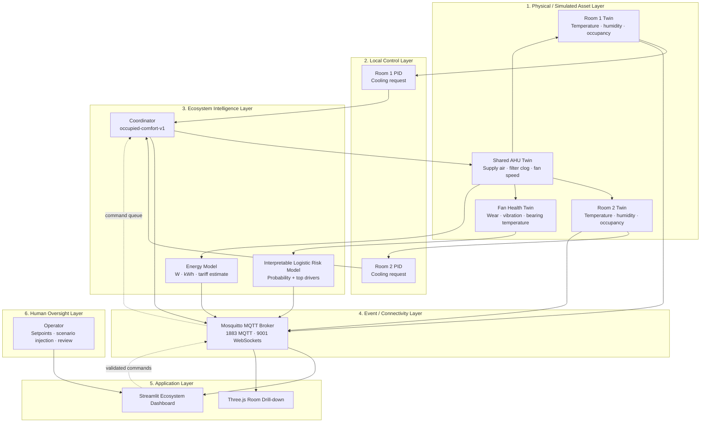

# Smart Lab Intelligent Ecosystem Architecture

This architecture extends the original single-room Digital Twin into a small, coordinated smart-facility ecosystem. Two independent room twins share a constrained AHU, so demand, energy use, equipment condition, and autonomous decisions are causally connected.

---

## 7-layer ecosystem architecture



---

## Coordination strategy: hybrid by design

The pilot is **centrally coordinated but locally safe**:

- Each room has a local PID controller that computes a cooling-airflow request.
- The central coordinator has authority only over the allocation of shared AHU capacity.
- Local safety and simulation limits remain in the room/AHU physics models.
- The coordinator never hides scarcity: it publishes both requested and granted airflow along with reason codes.

### `occupied-comfort-v1` policy

For every simulation tick:

1. Disabled zones request zero airflow.
2. Occupied rooms rank above unoccupied rooms.
3. Within that group, the larger positive temperature error ranks first.
4. Ties break on occupancy count, then stable room ID.
5. Capacity is granted in rank order until the shared AHU airflow is exhausted.

Examples of emitted reason codes include `occupied`, `above_setpoint`, `full_request_granted`, `capacity_limited`, and `unoccupied_lower_priority`.

This simple policy is intentionally transparent and deterministic. A later deployment can replace it with an optimiser only after operational priorities and fairness constraints are validated.

---

## Data flow and causality

```text
Occupancy ↑ → room heat and humidity ↑ → PID cooling request ↑
                 ↓
Shared demand ↑ → AHU airflow / energy ↑ → fan speed & bearing temperature ↑
                 ↓
Filter clog ↑ → available airflow ↓ and fan resistance ↑
                 ↓
Risk model → failure-risk probability + drivers → maintenance recommendation
                 ↓
Coordinator → explainable allocation → delivered supply air to each room
```

The system therefore demonstrates a genuine ecosystem interaction rather than independent room dashboards.

---

## Predictive intelligence lifecycle

1. `generate_fan_data.py` creates fixed-seed synthetic episodes for filter condition, fan load, vibration, bearing temperature, runtime, and a simulated failure label.
2. `train_fan_model.py` fits standardised NumPy logistic regression and writes a JSON artifact plus holdout metrics.
3. `fan_health.py` loads the JSON model at runtime, calculates its sigmoid probability, and exposes sorted feature contributions.
4. The dashboard displays risk band, probability, model version, and drivers.

The artifact is deliberately JSON rather than a pickle to make coefficients, thresholds, feature ordering, seed, and model version reviewable.

---

## MQTT design

- Retained telemetry exposes the latest state to newly connected dashboards and the 3D view.
- Commands are non-retained to avoid replaying operational actions.
- Paho callback threads enqueue commands; the simulator applies them only on its simulation thread. This avoids concurrent state mutation.
- `twin/ecosystem/status` is the authoritative retained online/offline heartbeat and Last Will & Testament topic.
- Legacy `twin/room1/*` payloads remain compatible, while `room2` mirrors their format.

See the complete topic contract in [README.md](../README.md#mqtt-topic-contract).

---

## Production security and governance boundary

The current broker is a local-coursework configuration, not a production security configuration. Before deployment, enforce:

- MQTT over TLS and WebSockets over TLS;
- unique device identities/certificates and least-privilege topic ACLs;
- network segmentation between operational technology and application users;
- schema/range validation, command acknowledgements, immutable audit logs, and alerting;
- local safe fallback if a coordinator or broker is unavailable;
- human approval for high-impact maintenance or comfort trade-offs.

Privacy is protected in the prototype by using aggregate occupancy only. No visual identification or personally identifying data is required. The model must be monitored for drift and recalibrated using governed real-facility data before it influences physical operations.
