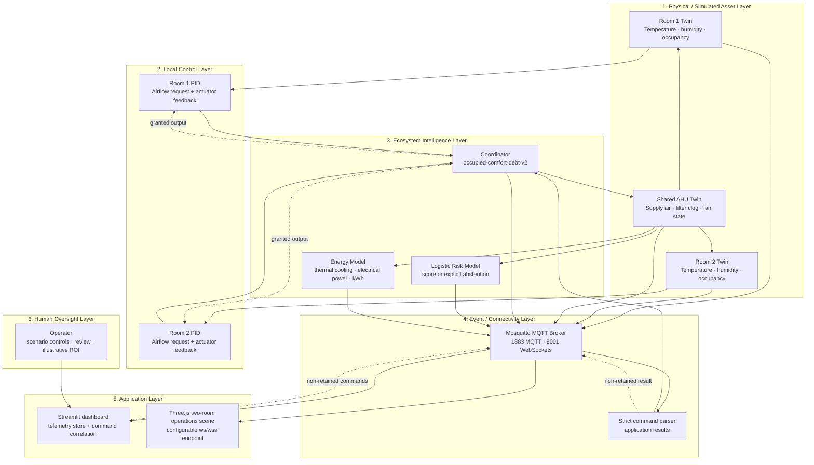

# Smart Lab Intelligent Ecosystem Architecture

This classroom architecture extends a single-room Digital Twin into two room twins that share a constrained simulated AHU. Comfort requests, finite airflow, equipment condition, energy, predictive status, and operator-visible decisions are causally connected. It is not a production building-control architecture or validated safety design.

---

## Six-layer ecosystem architecture



---

## Control and simulation boundary

The architecture is centrally coordinated with room-local request generation:

- Each room PID computes a requested output from room temperature and setpoint.
- The coordinator grants airflow from finite AHU capacity.
- The applied grant is fed back to the PID to reduce integral windup when the shared actuator cannot meet the request.
- Room and AHU models clamp simulated ranges, but the PIDs and clamps are not independently validated physical safety functions.
- The simulator has no authority over real equipment.

The `pause`, `resume`, and `emergency_stop` commands control simulation progression only. While paused or in `simulation_emergency_stop`, a tick does not advance room, fan, or cumulative states; instantaneous requests, flows, thermal cooling, and electrical power are zeroed. Cumulative energy and comfort debt are preserved. This boundary must not be described as a physical emergency stop, certified interlock, or broker/network shutdown.

---

## `occupied-comfort-debt-v2` allocation

For each running simulation tick:

1. Disabled zones request zero airflow.
2. Occupied rooms rank above unoccupied rooms.
3. Within the same occupancy class, current positive temperature error ranks first.
4. Bounded accumulated unmet comfort debt, occupancy count, and stable room ID break remaining ties.
5. Capacity is granted in rank order until the available AHU airflow is exhausted.
6. An occupied, enabled room accumulates debt in proportion to temperature error, unmet-request ratio, and time; full service or inactivity reduces debt. Debt is capped at `3600 °C·s`.

This adds temporal fairness to the earlier instantaneous policy: an eligible room that has been constrained over time can rise in priority. The deterministic decision publishes request, grant, comfort debt, consecutive limited-service time, priority components, and reason codes such as `occupied`, `comfort_debt_priority`, `above_setpoint`, `capacity_limited`, and `full_request_granted`.

The implementation remains deliberately simple. It is not proof of equitable real-facility outcomes; schedules, ventilation obligations, room criticality, and occupant needs would require governed requirements and validation.

---

## Thermal and electrical energy semantics

The room model computes delivered sensible **thermal cooling**:

```text
thermal cooling (W) = air density × specific heat × delivered airflow × max(room − supply temperature, 0)
```

The AHU model then estimates:

```text
cooling electrical power = total delivered thermal cooling / COP
fan electrical power = cubic airflow-speed model × filter resistance × wear penalty
total electrical power = cooling electrical + fan electrical
electrical energy (kWh) = integral of total electrical power over simulated time
```

The fixed classroom-simulation COP is `3.2`. MQTT keeps explicit fields such as `thermal_cooling_power_w`, `cooling_electrical_power_w`, `fan_electrical_power_w`, `total_electrical_power_w`, and `electrical_energy_kwh` while retaining some legacy aliases. Values are estimates, not meter readings or billing evidence.

---

## Predictive intelligence lifecycle and abstention

1. `generate_fan_data.py` creates fixed-seed synthetic episodes.
2. `train_fan_model.py` fits standardized NumPy logistic regression and writes inspectable JSON plus synthetic holdout metrics.
3. The checked-in executed notebook reconstructs the process, compares baselines, shows calibration/OOD examples, and asserts exact JSON artifact equality.
4. `fan_health.py` validates artifact type, version, schema, finite numeric arrays, positive scales, feature domains, and thresholds before scoring.
5. The publisher exposes probability/band/drivers for an in-domain score, or an explicit non-prediction state.

Runtime behavior is fail-visible:

- missing, nonnumeric, or non-finite telemetry → `prediction_status: abstained`, no numeric score;
- feature outside the stored synthetic training domain → `prediction_status: out_of_distribution`, no numeric score;
- missing/invalid model artifact in the default loader → `prediction_status: unavailable`, no numeric score.

The model is advisory presentation evidence and is not in the HVAC control path.

---

## Command and telemetry flow

- MQTT callback threads enqueue commands; only the simulation thread validates and mutates simulator state.
- Commands must be bounded strict JSON objects. Numeric validation rejects booleans, non-finite values, truncated choices, and values outside implemented ranges.
- The dashboard creates a unique `command_id`, publishes a non-retained command, tracks it as pending, and reconciles the matching result.
- The simulator publishes a non-retained application result with `accepted`, `changed`, `reason`, target/command, correlation metadata, applied values, and UTC timestamp.
- Retained commands are rejected before queuing. For the latest 1,024 non-empty command IDs in the current process, an identical repeated topic/payload replays the cached result without mutation; conflicting ID reuse is rejected. This deduplication state resets on restart.
- Retained `twin/ecosystem/presentation/state` uses a run ID and incrementing snapshot ID to package both rooms, AHU, risk, scenario, and coordination data from one simulator snapshot.
- Retained `twin/ecosystem/status` is the authoritative online/offline heartbeat and Last Will topic.

An application result is not the same as a durable transaction record. The result topic is non-retained, correlation state is in memory, and no delivery/processing guarantee beyond the current application behavior is claimed.

See the complete [MQTT topic contract](../README.md#mqtt-topic-contract).

---

## 3D and dashboard clients

The dashboard stores bounded room and risk histories behind a lock, separates broker transport state from simulator status, and reconciles correlated command results. The retained presentation payload is available for coherent clients, while the dashboard also consumes the detailed topic set.

The Three.js client is a unified read-only two-room/AHU scene. Its broker endpoint is not hard-coded to localhost: it accepts a percent-encoded `mqtt=ws://...` or `mqtt=wss://...` query value after protocol validation, otherwise it derives `ws(s)://<page-host>:9001`. The checked-in dashboard's 3D base URL is configurable through `ECOHVAC_3D_URL`.

---

## Audit integration status

`simulator/audit.py` implements and tests a local SQLite journal whose rows are linked with SHA-256 hashes. Verification detects sequence gaps, link/hash mismatches, invalid stored payloads, and chain-head mismatch. The publisher instantiates it only when `ECOHVAC_AUDIT_PATH` names a database path. It appends sanitized command metadata (topic, source/correlation, retained flag, payload size and digest—not raw values) with the result. Startup failures are visible on stderr/in `audit_error`; write failures are also marked in the published application result.

When the environment variable is unset, no journal is created. Dashboard-only recommendation responses are not in this path. The journal is locally tamper-evident, not immutable: an attacker able to rewrite the whole database and recompute the chain can forge a replacement history. Production governance still needs protected keys or external anchoring, access controls, retention, export/monitoring, and operational review.

---

## Broker security and production target

The default `mosquitto.conf` is anonymous and plaintext on ports `1883` and `9001`. The repository also contains an opt-in target example: `docker-compose.hardened.yml`, `mosquitto/config/mosquitto-hardened.conf`, `mosquitto/config/acl.hardened`, and setup notes in `mosquitto/README.md`. It disables anonymous access, requires a password file, provides placeholder least-privilege identities, and configures MQTT/TLS `8883` plus WSS `9002`.

The example includes no certificates, keys, passwords, secret-management service, firewall, gateway, renewal, or deployed security. Placeholder accounts and grants require review/replacement, especially for browser access. The simulator/dashboard host and port are configurable, but their Python MQTT clients do not currently configure TLS or authentication; the browser can select `wss:` but has no credential integration. Therefore this is not an end-to-end secure application profile. Segmentation, rate limits, monitoring, external audit anchoring, client integration, and independently reviewed fail-safe behavior remain deployment work.

The prototype uses aggregate occupancy counts and no identity, video, facial recognition, or biometrics. There is no claim of production validation, facilities/cybersecurity approval, certified safety behavior, or measured operational savings.