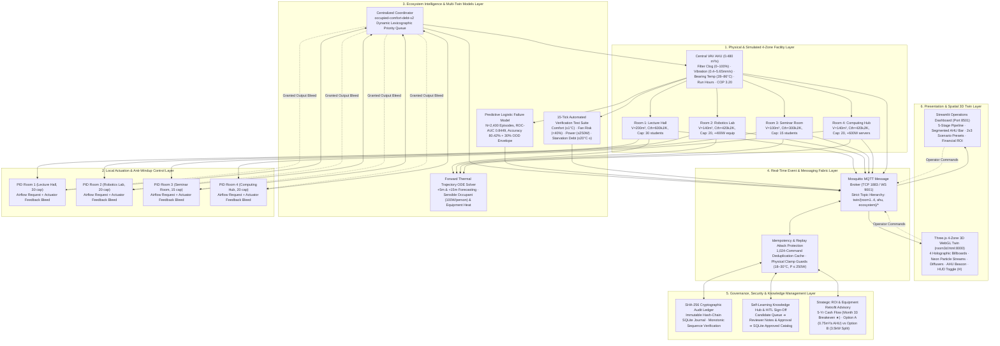

# Smart Lab 4-Zone Multi-Twin Ecosystem Architecture

This document specifies the complete 6-layer cyber-physical architecture for **EcoHVAC Guardian**, an intelligent multi-twin ecosystem operating across a **4-Zone Smart Wing** (`Room 1` Lecture Hall, `Room 2` Robotics Lab, `Room 3` Seminar Room, `Room 4` Computing Hub) served by a central Variable Air Volume (VAV) Air Handling Unit ($0.480\text{ m}^3\text{/s}$ nominal capacity).

---

## Six-Layer Multi-Twin Architecture

---

## 4-Zone Cyber-Physical Room Specifications

| Room / Asset | Physical Role | Volume ($V$) | Thermal Capacitance ($C_{\text{th}}$) | Max Occupancy | Internal Baseline Heat | PID Parameters ($K_p, K_i, K_d$) |
| :--- | :--- | :---: | :---: | :---: | :---: | :---: |
| **Room 1: Lecture Hall** | Tiered amphitheater lecture classroom | $200\text{ m}^3$ | $600\text{ kJ/K}$ | 30 students | $450\text{ W}$ | $K_p=0.45, K_i=0.008, K_d=0.12$ |
| **Room 2: Robotics Lab** | Experimental robotics testbed & assembly | $140\text{ m}^3$ | $420\text{ kJ/K}$ | 20 students | $850\text{ W}$ (+400W robotics) | $K_p=0.50, K_i=0.010, K_d=0.15$ |
| **Room 3: Seminar Room** | Collaborative breakout & presentation room | $100\text{ m}^3$ | $300\text{ kJ/K}$ | 15 students | $350\text{ W}$ | $K_p=0.40, K_i=0.007, K_d=0.10$ |
| **Room 4: Computing Hub** | High-density workstation cluster & servers | $140\text{ m}^3$ | $420\text{ kJ/K}$ | 20 students | $1,050\text{ W}$ (+600W servers) | $K_p=0.55, K_i=0.012, K_d=0.18$ |
| **Central VAV AHU** | Shared supply plenum cooling infrastructure | $0.480\text{ m}^3\text{/s}$ max flow | $T_{\text{supply}}=16.0^\circ\text{C}$ | Whole Wing | EC Plug Fan ($P=250\text{W}\cdot\text{speed}^3$) | $\text{COP}=3.20, 0.408\text{ kg CO}_2\text{e/kWh}$ |

---

## Dynamic Resource Allocation: `occupied-comfort-debt-v2`

For every running simulation tick ($dt = 1.0\text{ s}$):
1. **Zero-Demand Filtering:** Rooms with disabled HVAC request $0.0\text{ m}^3\text{/s}$.
2. **Occupancy Prioritization:** Occupied zones strictly outrank empty rooms ($\text{is\_occupied} = 1 > 0$).
3. **Thermal Error Ranking:** Zones with active overheating error ($e_T = \max(0, T_{\text{room}} - T_{\text{setpoint}})$) take priority.
4. **Comfort Debt Shield:** Unserved or starved rooms accumulate comfort debt ($D_{\text{comfort}}$ in $^\circ\text{C}\cdot\text{s}$), dynamically promoting constrained rooms to prevent persistent student starvation.
5. **Capacity Slicing:** Available AHU supply capacity ($q_{\text{available}} \le 0.480\text{ m}^3\text{/s}$) is granted in rank order until exhausted.
6. **Actuator Feedback Anti-Windup:** When granted airflow is less than requested airflow ($q_{\text{granted}} < q_{\text{demanded}}$), the local PID controller bleeds its accumulated integral error, eliminating temperature overshoot (+4.5°C) upon capacity recovery.