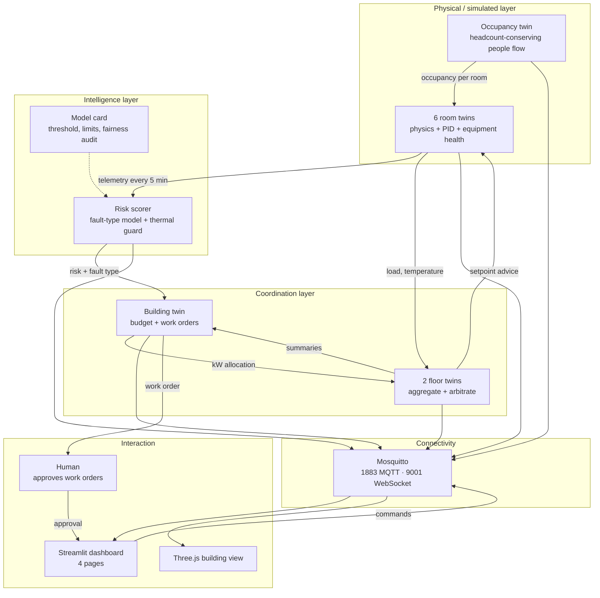
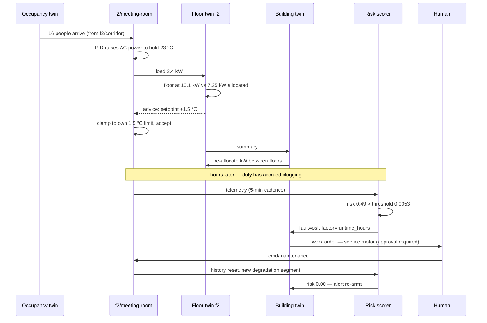

# Integrated Ecosystem — Smart Facility Digital Twin

How eleven interacting twins coordinate a 2-floor, 6-room facility, and why they
are **federated** rather than centralised.

> Mermaid note: line breaks inside node labels use ` `. A literal `\n`
> renders as the characters `\n` — this bit us in Project 1.

---

## 1. Twin inventory

| Twin | Count | State it owns | Reads | Publishes | Loop |
|---|---|---|---|---|---|
| **Room twin** | 6 | Temperature, humidity, occupancy, HVAC mode/power, equipment health | Neighbour temperatures, outdoor temperature, occupancy, advisories | Sensors, `hvac/state`, `ac/detail`, `health/telemetry` | **1 s** |
| **Floor twin** | 2 | Nothing — derived only | All rooms on its floor, its kW allocation | `{floor}/summary`, setpoint nudges | 10 s |
| **Building twin** | 1 | Open work orders (for dedupe) | Floor summaries, risk scores | `building/summary`, `building/advisory`, floor budgets | 30 s |
| **Occupancy twin** | 1 | Population of every node, corridors included | Time of day, room schedules | `building/occupancy` | 1 s |
| **Risk scorer** | 1 | 6 rolling telemetry windows | Room telemetry (5-min cadence) | `{room}/health/risk` | 30 s |
| **Energy view** | — | Derived | Room electrical load | Rolled into floor/building summaries | 10 s |

Room twins are the only twins that hold authoritative physical state. Everything
above them derives.

---

## 2. Data flow

### The interaction the brief asks for by name

> *"an energy twin interacting with an occupancy twin"*

That path is real, not decorative:

1. The occupancy twin moves a class out of `f1/lab-a` and into `f2/meeting-room`
   — **conserving headcount**, so the people genuinely arrive rather than one
   room's count falling and another's rising independently.
2. `f2/meeting-room`'s thermal load rises with them; its PID raises AC power.
3. The floor-2 twin sees floor load rise and, if it breaches its allocation,
   recommends setpoint nudges.
4. Higher duty accrues filter clogging and running hours on that unit, which the
   risk scorer sees hours later as rising failure probability.

Occupancy → energy → equipment wear → maintenance is a single causal chain, and
each link is exercised by tests.

---

## 3. Topics

| Topic | Direction | Retained | Content |
|---|---|---|---|
| `twin/{f}/{room}/temperature` \| `humidity` \| `occupancy` | room → all | ✓ | Project-1 sensor payload |
| `twin/{f}/{room}/hvac/state` | room → all | ✓ | on/off, AC power %, setpoint, mode |
| `twin/{f}/{room}/ac/detail` | room → all | ✓ | vent temperature, mode |
| `twin/{f}/{room}/health/telemetry` | room → all | ✓ | motor temp, rpm, vibration, clog, power, runtime |
| `twin/{f}/{room}/health/risk` | scorer → all | ✓ | probability, fault type, RUL, thermal guard, `model_version` |
| `twin/{f}/{room}/cmd/hvac` \| `setpoint` \| `mode` \| `occupancy` \| `timescale` | UI → room | ✗ | Control |
| `twin/{f}/{room}/cmd/maintenance` | UI → room | ✗ | `replace_filter` \| `service_motor` |
| `twin/{f}/summary` | floor → all | ✓ | Load, allocation, active nudges |
| `twin/{f}/cmd/power_budget` | building → floor | ✗ | kW allocation |
| `twin/building/summary` | building → all | ✓ | Load vs budget, occupancy, sim hour |
| `twin/building/occupancy` | occupancy → all | ✓ | Per-node counts, entrance flow |
| `twin/building/advisory` | building → human | ✗ | Work order, `requires_human_approval` |
| `twin/building/status` | LWT | ✓ | `online` / `offline` |

---

## 4. Centralised vs federated — the decision

**Chosen: federated room twins with hierarchical supervision.**

| | Centralised | **Federated (chosen)** |
|---|---|---|
| Control loops | All 6 in one process | 1 per room, independent |
| Blast radius of a crash | Every room stops cooling | Coordination degrades; cooling continues |
| Latency to a local disturbance | Bounded by the global loop | Bounded by the room's own 1 s loop |
| Scaling to N rooms | One loop grows with N | Rooms are independent; supervisors aggregate |
| Occupancy data | Every record reaches the centre | Counts stay room-local; only aggregates leave |
| Tuning | One controller must suit a 20 m² server room and a 70 m² lab | Each room tuned to its own thermal mass |
| Cost of a supervisor bug | Direct actuation of every room | Bounded advice a room may clamp or ignore |

### Why not centralised

The server room has a thermal time constant of seconds (8333 J/°C against
5000 W); the teaching lab's is minutes. A single controller must be tuned for the
slowest, which leaves the fastest room oscillating. We hit exactly this
numerically — an explicit integrator at a 60 s step made the server room swing
between the 15 °C and 40 °C clamps.

### Evidence, not assertion

These properties are locked by tests, so the claim is checkable:

| Claim | Test |
|---|---|
| A command to one room cannot affect another | `test_rooms_are_isolated` |
| A room keeps controlling itself with no supervisor present | `test_twin_runs_without_any_supervisor` |
| Supervisors stay silent when there is no problem | `test_no_nudges_when_within_budget` |
| Advice can never exceed 1.5 °C | `test_nudges_are_bounded` |
| Arbitration cannot mutate a room | `test_arbitration_does_not_mutate_room_state` |
| The room, not the supervisor, enforces the cap | `test_room_clamps_an_oversized_advisory` |
| Load shedding is shared, not dumped on one room | `test_burden_is_shared_not_dumped_on_one_room` |
| Critical load is never shed | `test_critical_load_is_exempt` |

The last one matters: the room enforcing its own limit means a **spoofed or buggy
advisory cannot make a room unsafe**. Authority flows downward as *advice* and
stops at a bound the recipient owns.

### The conflict the supervisors exist to resolve

The building's electrical allocation is **15 kW**, against **21.2 kW** of
installed cooling (3.5 + 2.6 + 5.0 + 4.2 + 2.4 + 3.5). The floors declare
9 + 8 = 17 kW between them. Both gaps are deliberate: electrical services are
sized with a diversity factor, on the assumption that not every unit runs flat
out simultaneously.

That over-subscription is what gives the building twin something real to
arbitrate. An earlier layout set the budget at 40 kW — above installed capacity —
so it could never be breached, the arbitration never ran, and its tests passed
only against fabricated inputs. `test_building_budget_is_reachable` now asserts
the budget stays *below* installed capacity so the coordination layer cannot
quietly become dead code again.

### The honest limitation

Bounded authority means the budget is **best-effort**. Under peak load floor 1
settles at 8.81 kW against a 7.75 kW allocation, because both sheddable rooms are
already at the +1.5 °C cap. The safety bound wins over the budget by design.
Closing that gap needs load shedding of non-critical circuits — a facilities
decision, not a control-loop one.

---

## 5. One full closed loop

Every arrow is an MQTT message on a topic in §3, and the whole sequence is
verified end to end in the Task 8 integration check.

---

## 6. Failure modes of the ecosystem itself

| If this fails | What happens | Why |
|---|---|---|
| Building twin | Floors keep their last allocation; rooms keep cooling | Allocation is advisory and cached |
| A floor twin | Its rooms keep their own control; no nudges arrive | Rooms never depended on it |
| Risk scorer | Risk topics go stale; cooling unaffected | Scoring is observational; a missing model degrades to disabled |
| Occupancy twin | Rooms hold their last occupancy | Occupancy is an input, not a control signal |
| Broker | Twins run blind; dashboard shows `offline` via LWT | Physics is local to each twin |
| A room twin | That room only | No other twin reads its internal state |

There is no component whose failure stops the building from being cooled. That is
the property the federated design was chosen for.
