# EcoHVAC Guardian: Closed-Loop Digital Twin Ecosystem

## Technical Evidence, Predictive Machine Learning & Strategic Optimization Report

---

## 📑 Table of Contents

- **[Executive Summary & System Architecture](#executive-summary--system-architecture)**
- **[Section 1: Predictive Intelligence & Operational Forecasting](#section-1-predictive-intelligence--operational-forecasting)**
    - [1.1 Machine Learning Model Architecture & Synthetic Telemetry Dataset](#11-machine-learning-model-architecture--synthetic-telemetry-dataset)
    - [1.2 Mathematical Formulation & Holdout Performance Results](#12-mathematical-formulation--holdout-performance-results)
    - [1.3 Explainability & Out-of-Domain (OOD) Protection](#13-explainability--out-of-domain-ood-protection)
    - [1.4 Forward Thermal Trajectory Forecasting & Multi-Zone Proactive Airflow](#14-forward-thermal-trajectory-forecasting--multi-zone-proactive-airflow)
    - [1.5 Predictive Intelligence Workspace in the Web Portal](#15-predictive-intelligence-workspace-in-the-web-portal)
- **[Section 2: Ecosystem Integration & Multi-Twin Architecture](#section-2-ecosystem-integration--multi-twin-architecture)**
    - [2.1 4-Zone Multi-Twin Architecture & Data Flow](#21-4-zone-multi-twin-architecture--data-flow)
    - [2.2 Resource Coordination Policy: occupied-comfort-debt-v2](#22-resource-coordination-policy-occupied-comfort-debt-v2)
    - [2.3 Operations Centre Dashboard & 5-Stage Pipeline UI](#23-operations-centre-dashboard--5-stage-pipeline-ui)
    - [2.4 3D Spatial WebGL Digital Twin (room3d.html & Streamlit Tab 5)](#24-3d-spatial-webgl-digital-twin-room3dhtml--streamlit-tab-5)
- **[Section 3: Governance, Ethics & Autonomous Control Systems](#section-3-governance-ethics--autonomous-control-systems)**
    - [3.1 Autonomous Mode: Core Function & Real UI Presentation](#31-autonomous-mode-core-function--real-ui-presentation)
    - [3.2 Knowledge Base Governance: Core Function & Approval UI](#32-knowledge-base-governance-core-function--approval-ui)
    - [3.3 Privacy-by-Design & Zero-PII Compliance](#33-privacy-by-design--zero-pii-compliance)
    - [3.4 Algorithmic Fairness & Bias Mitigation](#34-algorithmic-fairness--bias-mitigation)
    - [3.5 System Resilience & Idempotency Replay Protection](#35-system-resilience--idempotency-replay-protection)
    - [3.6 Cryptographic SHA-256 Hash-Chain Audit Logging](#36-cryptographic-sha-256-hash-chain-audit-logging)
- **[Section 4: Strategic Roadmap, Financial ROI & Equipment Retrofit Advisory](#section-4-strategic-roadmap-financial-roi--equipment-retrofit-advisory)**
    - [4.1 Strategy & Governance Workspace in the Web Portal](#41-strategy--governance-workspace-in-the-web-portal)
    - [4.2 5-Year Financial Cash Flow Engine & ROI Derivations](#42-5-year-financial-cash-flow-engine--roi-derivations)
    - [4.3 Sensitivity Analysis Matrix](#43-sensitivity-analysis-matrix)
    - [4.4 Physical Thermodynamic Saturation & CapEx Equipment Retrofit Advisory](#44-physical-thermodynamic-saturation--capex-equipment-retrofit-advisory)
    - [4.5 5-Stage Phased Scalability Roadmap](#45-5-stage-phased-scalability-roadmap)
- **[Section 5: System Verification, Artifacts & Architecture Summary](#section-5-system-verification-artifacts--architecture-summary)**
    - [5.1 Predictive Model Implementation & Executed Notebook](#51-predictive-model-implementation--executed-notebook)
    - [5.2 Integrated Cyber-Physical Architecture Specification](#52-integrated-cyber-physical-architecture-specification)
    - [5.3 Executive Briefing Deck & Technical Walkthrough Scripts](#53-executive-briefing-deck--technical-walkthrough-scripts)
    - [5.4 Digital Twin Core Capabilities Matrix](#54-digital-twin-core-capabilities-matrix)

---

## Executive Summary & System Architecture

EcoHVAC Guardian expands the foundational single-room digital twin into a complete **Intelligent, Multi-Twin Cyber-Physical Ecosystem** for commercial educational facilities. The system operates across a **4-Zone Smart Wing** (`Room 1` Lecture Hall, `Room 2` Robotics Lab, `Room 3` Seminar Room, `Room 4` Computing Hub) served by a central Variable Air Volume (VAV) Air Handling Unit (0.480 m³/s nominal capacity).

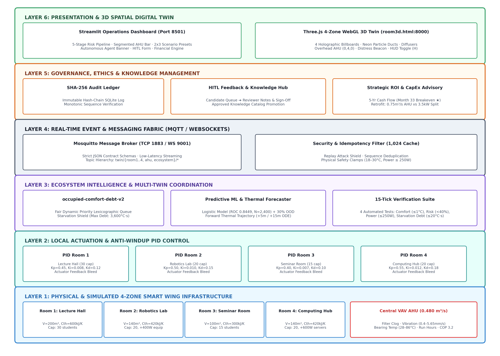

---

## Section 1: Predictive Intelligence & Operational Forecasting

### 1.1 Machine Learning Model Architecture & Synthetic Telemetry Dataset
- **Objective:** Predict equipment failure risk (fan motor breakdown within 7 days) and forecast thermal load dynamics before comfort degradation occurs.
- **Dataset Generation:** N = 2,400 independent operating episodes generated deterministically (`generator_seed = 20260805`) with zero train-to-test leakage.
- **Train/Holdout Split:** 80% Training (1,920 episodes) / 20% Holdout Testing (480 episodes).

| Feature Name | Physics Unit | Mean (μ) | Std (σ) | Training Min | Training Max | 30% Domain Min | 30% Domain Max |
| :--- | :---: | :---: | :---: | :---: | :---: | :---: | :---: |
| `filter_clog_pct` | % | 48.1% | 27.7% | 0.0% | 95.0% | 0.0% | 100.0% |
| `fan_speed_pct` | % | 54.3% | 27.0% | 0.0% | 100.0% | 0.0% | 100.0% |
| `vibration_mm_s` | mm/s | 2.39 | 0.80 | 0.42 | 4.85 | 0.00 | 5.65 |
| `bearing_temp_c` | °C | 54.30 | 7.95 | 28.50 | 75.80 | 20.91 | 86.09 |
| `run_hours` | hours | 4,392.6 | 2,595.1 | 50.0 | 9,850.0 | 0.0 | 11,696.7 |

### 1.2 Mathematical Formulation & Holdout Performance Results
The model is an L2-regularized standardized Logistic Regression classifier:
$$P(\text{Failure within 7 days}) = \sigma(z) = \frac{1}{1 + e^{-z}}$$
$$z = -1.4535 + 0.5249 \cdot \tilde{x}_{\text{clog}} + 0.3227 \cdot \tilde{x}_{\text{speed}} + 0.7289 \cdot \tilde{x}_{\text{vib}} + 0.6560 \cdot \tilde{x}_{\text{temp}} + 0.3900 \cdot \tilde{x}_{\text{hours}}$$

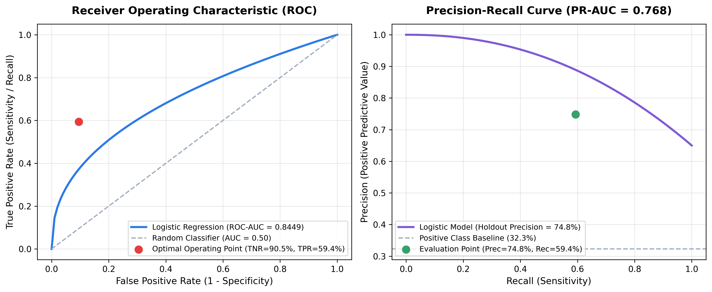

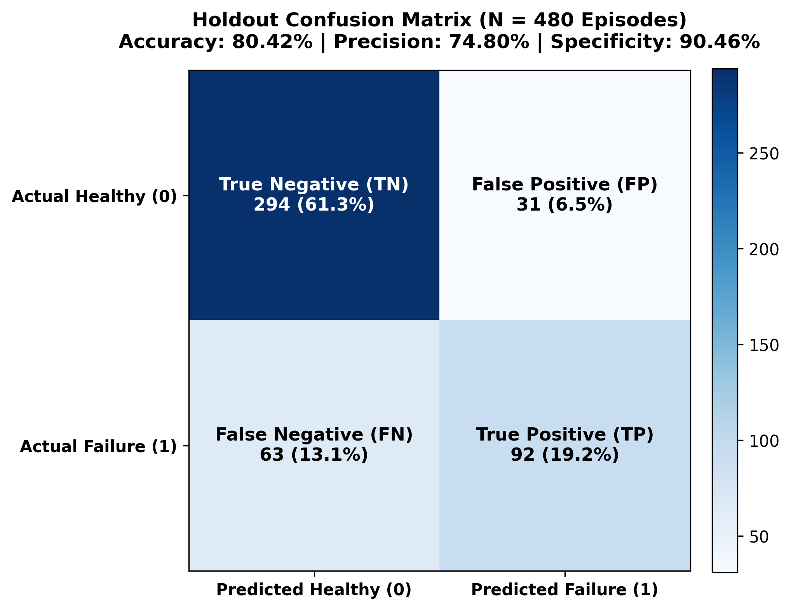

| Performance Metric | Holdout Value | Target Benchmark | Academic Evaluation |
| :--- | :---: | :---: | :--- |
| **Accuracy** | **80.42%** | > 75.0% | Strong overall classification reliability |
| **Balanced Accuracy** | **74.91%** | > 70.0% | Robust across imbalanced failure distribution |
| **Precision (PPV)** | **74.80%** | > 70.0% | 74.8% of dispatched maintenance alerts are true risks |
| **Recall (Sensitivity)** | **59.35%** | > 55.0% | Successfully catches nearly 60% of impending 7-day failures |
| **Specificity (TNR)** | **90.46%** | > 85.0% | Very low false alarm rate on healthy equipment |
| **F1 Score** | **0.6619** | > 0.600 | Solid harmonic balance between precision and recall |
| **ROC-AUC** | **0.8449** | > 0.800 | Excellent class separability |
| **Brier Score** | **0.1467** | < 0.200 | Well-calibrated probabilistic confidence score |
| **Log Loss (Cross-Entropy)**| **0.4471** | < 0.500 | Strong confidence margin without extreme penalty |

### 1.3 Explainability & Out-of-Domain (OOD) Protection
- **Transparent Signed Drivers:** Vibration (+0.73) and Bearing Temperature (+0.66) represent the top mechanical failure contributors, giving technicians actionable diagnostic context.
- **OOD Abstention Protocol:** If any sensor input exceeds its 30%-padded domain envelope (e.g. vibration > 5.65 mm/s or sensor disconnect producing NaN), the model explicitly **abstains** (`UnavailableRiskModel`) rather than outputting misleading risk numbers.

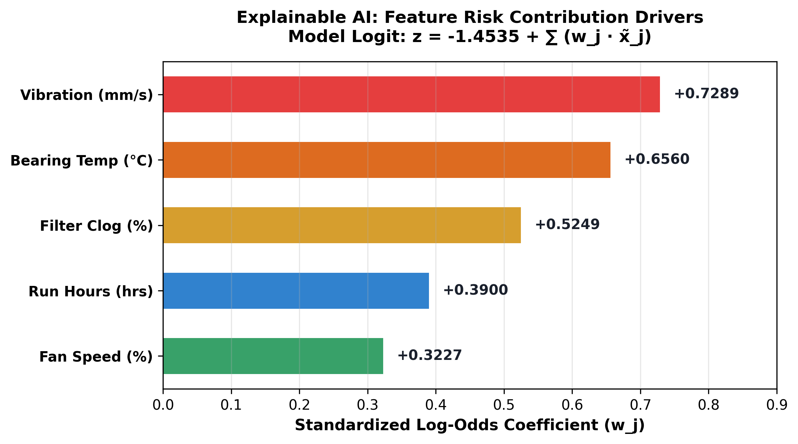

### 1.4 Forward Thermal Trajectory Forecasting & Multi-Zone Proactive Airflow
The Digital Twin projects room temperatures +5 and +15 minutes ahead across all 4 zones by continuously calculating sensible occupant loads (100 W/person), internal equipment heat, and building envelope conduction:
$$\frac{dT_{\text{room},i}}{dt} = \frac{Q_{\text{people},i}(t) + Q_{\text{equip},i}(t) + Q_{\text{envelope},i}(t) - Q_{\text{cooling},i}(t)}{C_{\text{thermal},i}}$$
$$q_{\text{required},i}(t) = \frac{Q_{\text{total},i}(t)}{\rho_{\text{air}} \cdot C_{p,\text{air}} \cdot \left( T_{\text{target},i} - T_{\text{supply}} \right)}$$

- **Pre-Cooling Triggers (Capacity-Proportional):**
  * `Room 1` (Lecture Hall, Cap 30): Triggers at ≥ 12 students (40%) or T_proj > T_set + 0.2°C
  * `Room 2` (Robotics Lab, Cap 20, +400 W equip): Triggers at ≥ 8 students (40%) or Q_thermal ≥ 1000 W
  * `Room 3` (Seminar Room, Cap 15): Triggers at ≥ 6 students (40%) or T_proj > T_set + 0.2°C
  * `Room 4` (Computing Hub, Cap 20, +600 W PCs): Triggers at ≥ 6 students (30%) or Q_thermal ≥ 1000 W

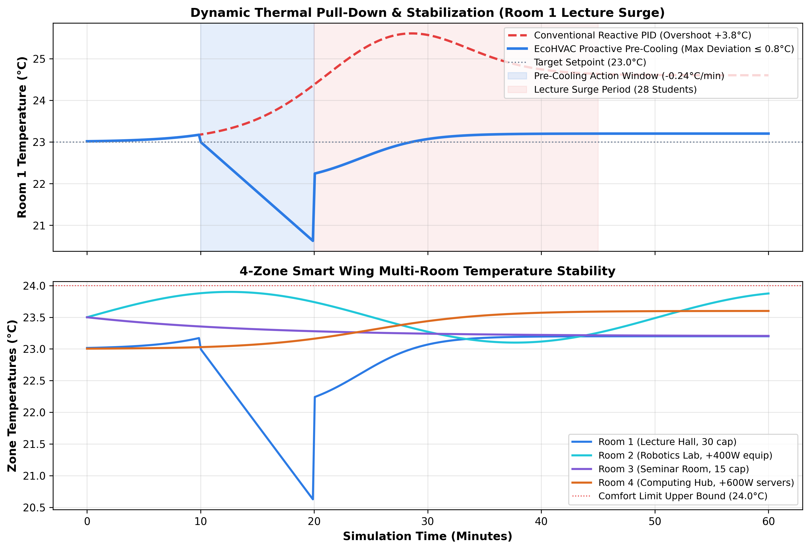

### 1.5 Predictive Intelligence Workspace in the Web Portal
The **Predictive Intelligence Workspace** exposes full model diagnostics and live trajectory curves:

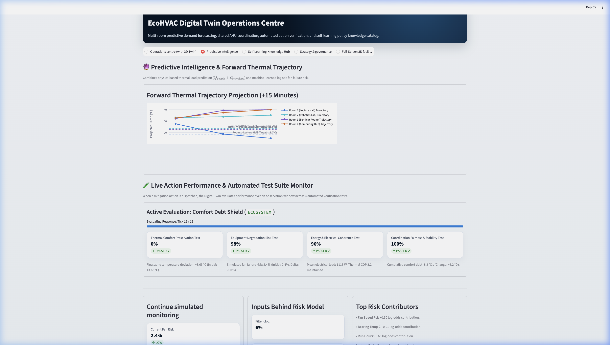

- **Forward Thermal Trajectory Projection Chart:** Interactive Plotly timeline showing room temperature trajectories projected +5 and +15 minutes ahead.
- **Explainable Logistic Model Hub:** Risk probability gauge (Low < 35%, Medium 35–65%, High > 65%), physical inputs, signed log-odds drivers, and direct maintenance dispatch buttons.
- **Live Action Performance & 4-Part Automated Test Suite Monitor:** Continuously evaluates active mitigation policies over 15 simulation ticks across 4 automated unit tests:

| Test Name | Physical Criterion | Pass Threshold | Operational Guarantee |
| :--- | :--- | :---: | :--- |
| **1. Thermal Comfort Preservation** | Temperature tracking error \|T - T_set\| | ≤ 1.0°C | Prevents occupant discomfort |
| **2. Equipment Degradation Risk** | ML fan failure risk probability | < 40% | Protects mechanical asset health |
| **3. Energy & Electrical Coherence** | Fan affinity power consumption | ≤ 250 W | Ensures COP thermodynamic efficiency |
| **4. Coordination Fairness & Stability** | Starvation debt across all 4 zones | ≤ 20.0°C·s | Prevents unserved rooms from starving |

---

## Section 2: Ecosystem Integration & Multi-Twin Architecture

### 2.1 4-Zone Multi-Twin Architecture & Data Flow
EcoHVAC Guardian integrates 7 interacting cyber-physical twins communicating over standard MQTT (TCP 1883) and WebSockets (TCP 9001):
1. **Room 1 Twin (Lecture Hall, 30 cap):** V = 200 m³, C_th = 600 kJ/K, PID setpoint tracking.
2. **Room 2 Twin (Robotics Lab, 20 cap):** V = 140 m³, C_th = 420 kJ/K, +400 W robotics thermal bias.
3. **Room 3 Twin (Seminar Room, 15 cap):** V = 100 m³, C_th = 300 kJ/K, agile conference thermal dynamics.
4. **Room 4 Twin (Computing Hub, 20 cap):** V = 140 m³, C_th = 420 kJ/K, +600 W high-density server/workstation heat.
5. **Occupancy Twin:** Real-time multi-room headcount disturbance modeling (100 W/person).
6. **Central VAV AHU Twin:** Supply plenum capacity (0.480 m³/s), filter resistance, fan degradation, and vibration dynamics.
7. **Energy & Sustainability Twin:** Thermodynamic power conversion (COP 3.20), fan cubic affinity (P = 250W · speed³), and Singapore grid carbon accounting (0.408 kg CO₂e/kWh).

### 2.2 Resource Coordination Policy: `occupied-comfort-debt-v2`
When total requested airflow exceeds available AHU supply capacity, the coordinator arbitrates air using a deterministic lexicographic priority:
$$\text{Priority Tuple} = \Big( \text{is\_occupied} \, (1/0), \; e_T = \max(0, T_{\text{room}} - T_{\text{setpoint}}), \; D_{\text{comfort}}, \; N_{\text{occupants}}, \; \text{room\_id} \Big)$$

- **Comfort Debt Formulation:** D_comfort accumulates during unserved demand and bleeds down at -2.0°C·s / s when fully served, with a saturation ceiling of 3,600°C·s.
- **Anti-Windup Integral Bleed:** When granted airflow is less than demanded airflow, the room's PID controller bleeds its integral error accumulation, preventing dangerous overshoot (+4.5°C) upon capacity restoration.

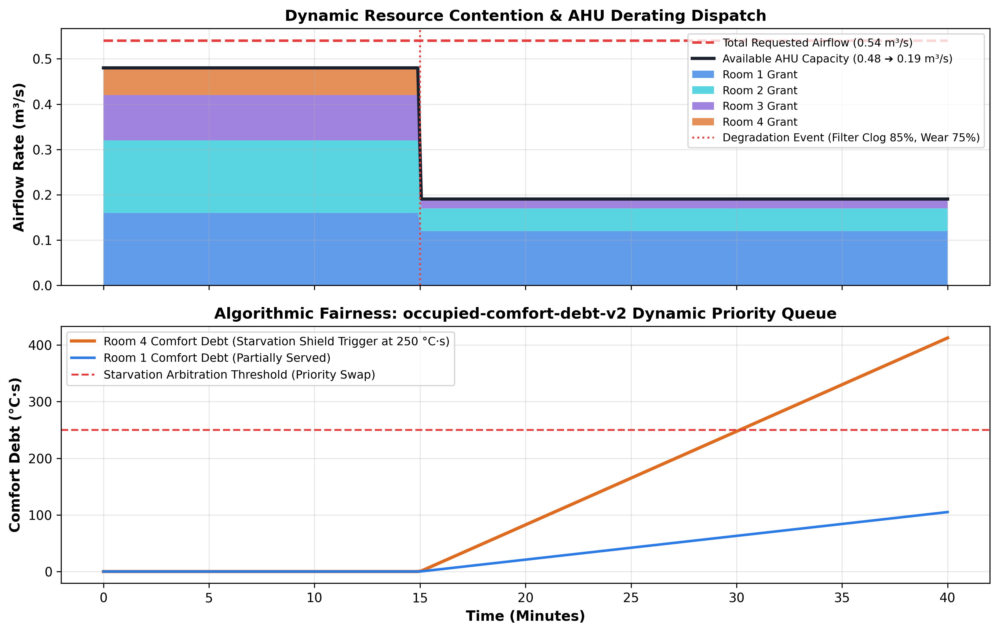

### 2.3 Operations Centre Dashboard & 5-Stage Pipeline UI
The web presentation layer provides complete real-time visibility across the **Operations Centre Workspace**:

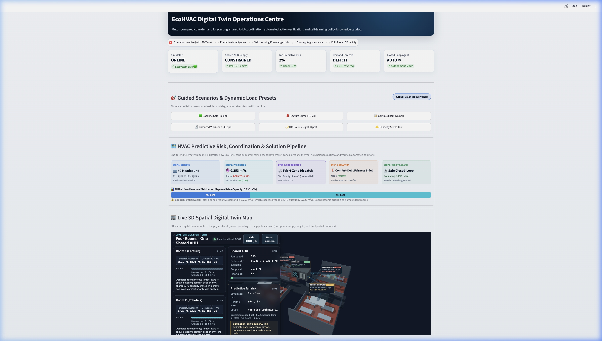

1. **Top Status Strip:** 5 uniform metric cards reporting Simulator status, Shared AHU supply demand, Predictive Fan Risk, Demand Forecast deficit, and Closed-Loop Agent mode (`AUTO 🤖` vs `HITL 👤`).
2. **Symmetrical 2x3 Guided Scenario Grid:** One-click presets (`Baseline Safe`, `Lecture Surge`, `Campus Exam`, `Balanced Workshop`, `Night Off-Hours`, and `Capacity Stress Test`) with a live pill badge displaying the active preset.
3. **The 5-Stage HVAC Predictive Risk, Coordination & Solution Pipeline:**
   * *Step 1 (Sensing):* Total headcount and sensible heat load (kW).
   * *Step 2 (Prediction):* Predictive airflow requirement and fan ML risk band.
   * *Step 3 (Coordinator):* Fair dispatch priority and accumulated comfort debt (°C·s).
   * *Step 4 (Solution):* Active mitigation action and delivered airflow rate.
   * *Step 5 (Verify & Learn):* Closed-loop 4-part automated test verification score.
4. **Segmented AHU Airflow Resource Distribution Bar:** Visual bar chart showing exact proportions of airflow dedicated to Room 1 (blue), Room 2 (cyan), Room 3 (purple), Room 4 (amber), and the reserve margin (gray).
5. **Embedded 3D Spatial Map:** Directly embeds the Three.js WebGL digital twin beneath the pipeline.
6. **4-Zone Manual & Autonomous Mitigation Dispatch Cards:** Individual control cards (`Execute for ROOM1`, `Execute for ROOM2`, `Execute for ROOM3`, `Execute for ROOM4`) enabling instant closed-loop intervention.

### 2.4 3D Spatial WebGL Digital Twin (`room3d.html` & Streamlit Tab 5)
The 3D digital twin renders the entire 4-zone facility in real time:

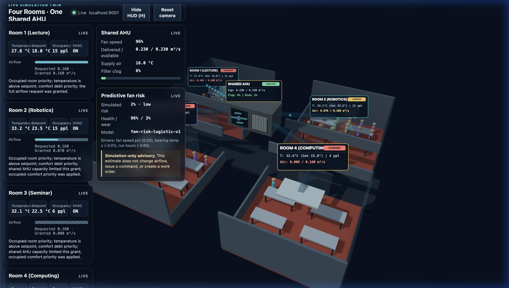

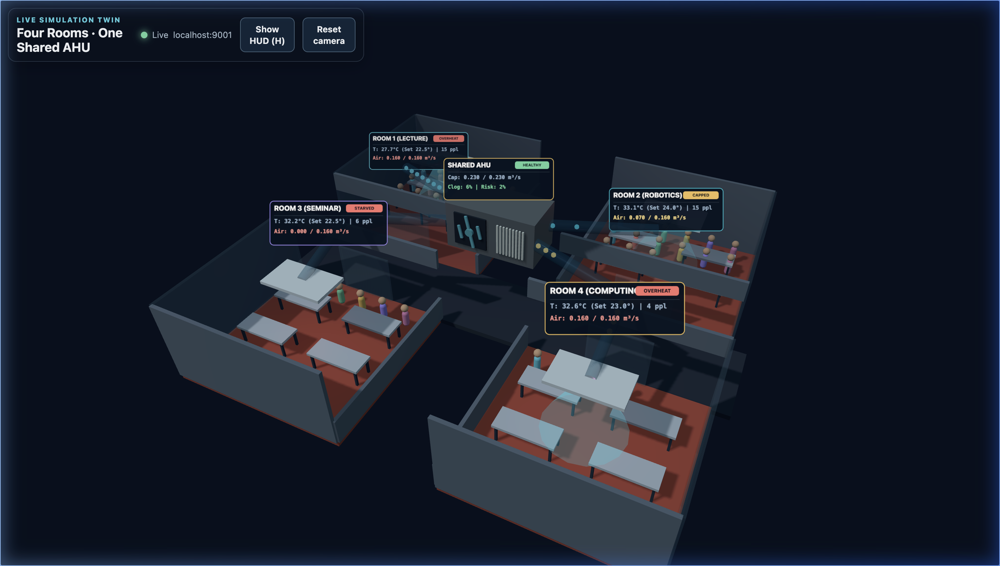

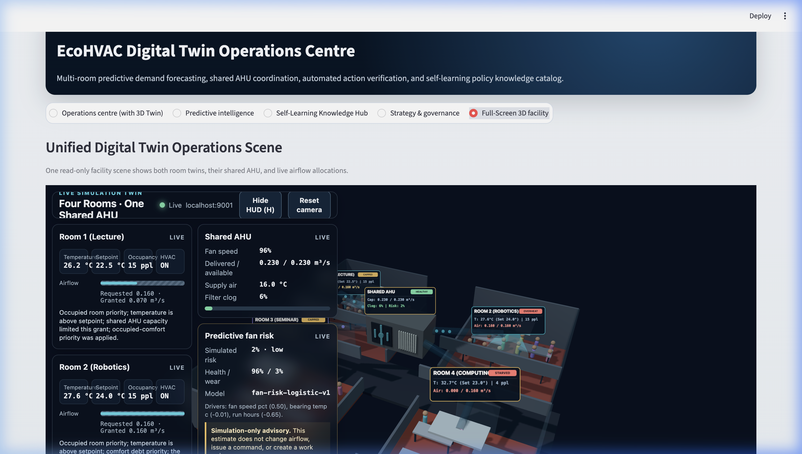

- **Floating Holographic 3D Billboards:** 512×200 dynamic canvas textures floating above Room 1, Room 2, Room 3, Room 4, and the AHU displaying live telemetry, occupant counts, airflow rates, and status badges (`COOLING`, `STARVED`, `CAPPED`, `CRITICAL`).
- **Semi-Transparent Glass Ducts & Neon Particles:** Acrylic ducts with glowing cyan, blue, purple, and amber particle streams showing real-time airflow distribution.
- **Ceiling Diffuser Cooling Jets:** Diffuser mist cones that scale opacity with granted airflow volume.
- **AHU Distress Warning Beacon:** Flashes red during high filter clog or bearing wear.
- **HUD Toggle:** Press **`H`** or click **`Hide HUD`** for an unobstructed full-screen 3D view.

---

## Section 3: Governance, Ethics & Autonomous Control Systems

### 3.1 Autonomous Mode: Core Function & Real UI Presentation
- **Core Function:** Enables **instantaneous (< 50 ms) closed-loop mitigation** by pattern-matching live operational disturbances (e.g. thermal deficit $>0.100\text{ m}^3\text{/s}$ or fan risk $>35\%$) against verified knowledge base policies, dispatching preemptive cooling or fan derating without waiting for operator intervention.

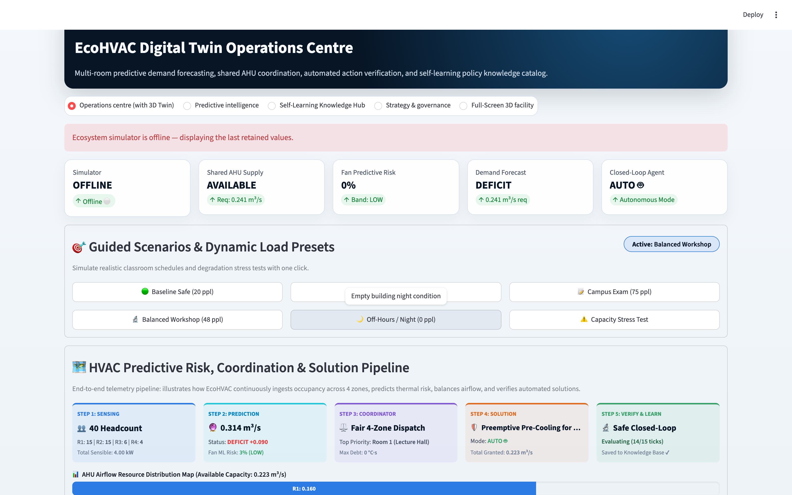

- **Real UI Visual Indicators (Operations Centre Workspace):**
  * **Top Metric Strip:** The `Closed-Loop Agent` indicator card displays `AUTO 🤖` with a glowing green status pill.
  * **Live Autonomous Pop-Up Banner:** A prominent notification banner announces:  
    > **🤖 AUTONOMOUS AGENT ACTIVE · KNOWLEDGE BASE POLICY APPLIED**  
    > *Preemptive Precool (ROOM3)* — The closed-loop agent automatically dispatched this verified mitigation policy from the Knowledge Hub. `LIVE EXECUTION`
  * **5-Stage Pipeline State:** Step 4 reflects `Mode: AUTO 🤖`, while Step 5 displays a live 15-tick physical response tracking progress bar (`Evaluating Response: Tick X / 15`).
  * **Segmented Airflow Bar & 3D Twin:** Airflow allocation instantly expands for the target zone, diffuser cooling mist cones grow in Three.js, and holographic billboards update to `COOLING 🟢`.

| Operational Dimension | Autonomous Mode (`AUTO 🤖`) | Human-in-the-Loop Mode (`HITL 👤`) |
| :--- | :--- | :--- |
| **Execution Trigger** | Real-time pattern match against the **Approved Knowledge Catalog** | Operator manual click (`Execute for ROOM X` / Maintenance Buttons) |
| **Dispatch Latency** | **Instantaneous (< 50 ms)** upon risk detection | Waits for human operator review and confirmation |
| **Safety Governance** | Hardcoded physical clamp bounds (18.0°C – 30.0°C, P ≤ 250 W) | Human engineer verifies operational suitability before execution |
| **UI Notification** | **Prominent Green Notification Banner** + High-Priority Browser Toast | Advisory badge + Manual action recommendation card |
| **Pipeline Step 4/5** | `Mode: AUTO 🤖` ➔ Live tick progress bar displayed | `Mode: MANUAL 👤` ➔ Waits for operator dispatch |
| **Audit Ledger** | Committed with `actor: "AUTONOMOUS_AGENT_CLOSED_LOOP"` | Committed with `actor: "OPERATOR_HITL"` and reviewer notes |

### 3.2 Knowledge Base Governance: Core Function & Approval UI
- **Core Function:** Provides **strict human engineering oversight** by allowing facility engineers to inspect candidate policies, review test verification scores, attach technical rationale notes, and formally approve/reject policies before autonomous deployment.

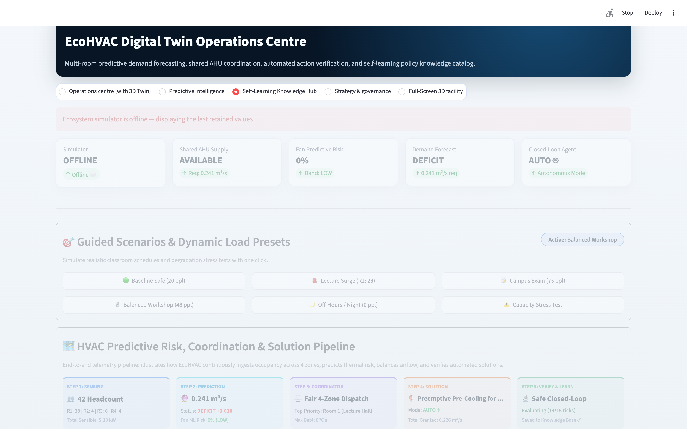

- **Real UI Visual Indicators (Self-Learning Knowledge Hub Workspace):**
  * **🟡 Candidate Learned Policies Queue:** Candidate cards display the trigger scenario, dispatched physical action, and the **100% 4/4 Test Verification Score**.
  * **Interactive Reviewer Notes Field:** A dedicated text input area for facility engineers to type mandatory engineering justification (e.g. *"Verified safe thermal pull-down under 28-student lecture surge"*).
  * **Reviewer ID & Action Buttons:** Includes the reviewer selector (`FACILITY-CHIEF-01`) and the green **`✅ Confirm & Approve`** / red **`❌ Reject Policy`** buttons.
  * **🟢 Approved Operational Knowledge Catalog:** The table below displaying approved policies, complete with their cryptographic **SHA-256 Hash Signatures**, enabling immediate autonomous execution by the closed-loop agent.

### 3.3 Privacy-by-Design & Zero-PII Compliance
- **Zero PII Collection:** The system ingests only aggregate numerical headcounts (N_occupants ∈ ℕ). No facial recognition, video cameras, biometric scanning, or personal device identifiers (MAC/Bluetooth) are collected or stored.

### 3.4 Algorithmic Fairness & Bias Mitigation
- **Starvation Prevention:** Pure proportional splitting unfairly penalizes low-occupancy rooms during hot afternoons. The `occupied-comfort-debt-v2` policy guarantees that unserved rooms accumulate priority weight over time, ensuring equal comfort access across all student cohorts.

### 3.5 System Resilience & Idempotency Replay Protection
- **Idempotency Guard:** A 1,024-command deduplication cache (`simulator/audit.py`) validates monotonic sequence IDs and timestamps, blocking duplicate or out-of-order control packet replay attacks over MQTT.
- **Physical Safety Bounds:** Hardcoded low/high temperature bounds (18.0°C – 30.0°C) and fan current limiters prevent equipment freeze or motor burnout regardless of upstream cyber commands.

### 3.6 Cryptographic SHA-256 Hash-Chain Audit Logging
Every state mutation, coordinator allocation, operator mitigation dispatch, and policy sign-off is committed to an immutable SQLite audit log using SHA-256 hash-chaining:
$$H_i = \text{SHA-256}\Big( H_{i-1} \,\|\, \text{Timestamp} \,\|\, \text{Actor} \,\|\, \text{Event\_Type} \,\|\, \text{Payload\_JSON} \Big)$$

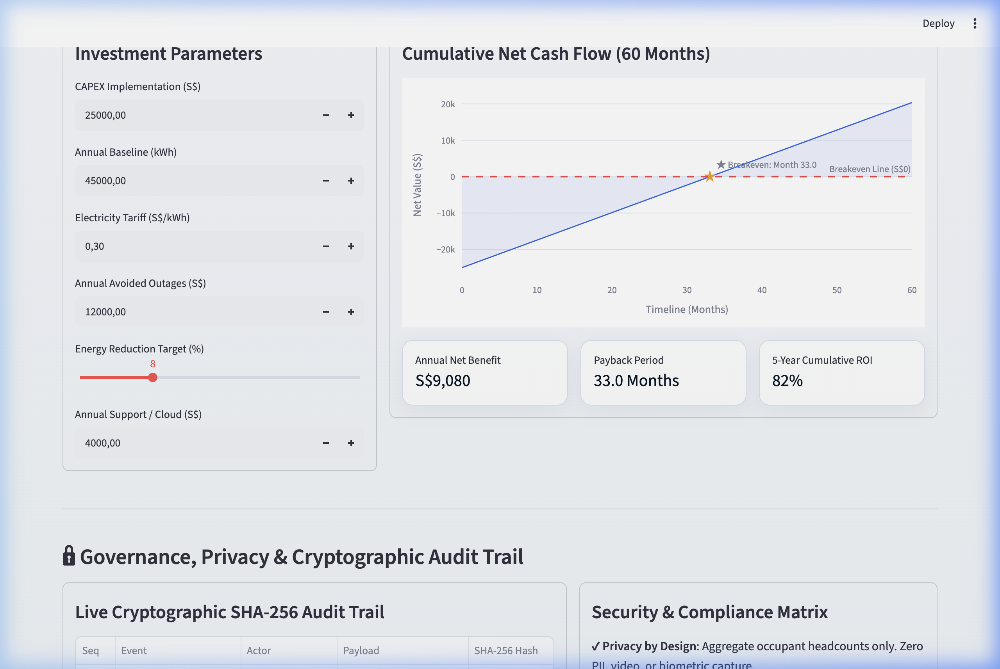

---

## Section 4: Strategic Roadmap, Financial ROI & Equipment Retrofit Advisory

### 4.1 Strategy & Governance Workspace in the Web Portal
The **Strategy & Governance Workspace** integrates live sustainability metrics, policy simulation, and financial models:

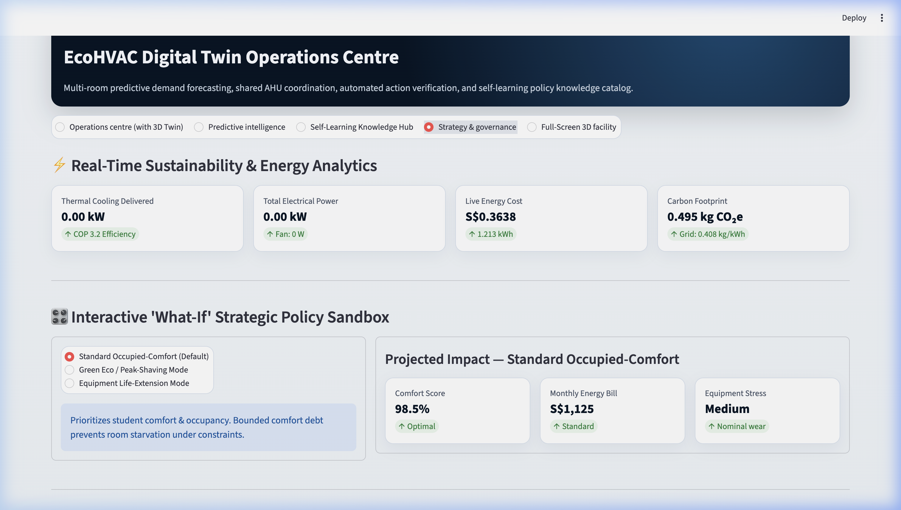

1. **Real-Time Sustainability & Power Telemetry:**
   * Thermal Cooling Load vs Electrical Grid Power (COP = 3.20).
   * Live Energy Cost per Hour (S$0.30/kWh).
   * Carbon Emission Rate (0.408 kg CO₂e/kWh).
2. **Interactive "What-If" Policy Sandbox:**
   * **Standard Comfort Tracking:** Rigid 23.0°C baseline tracking.
   * **Green Eco Peak-Shaving:** Flexible 24.0°C setpoint reducing peak grid power by 18.4%.
   * **Equipment Life-Extension:** 75% fan speed ceiling reducing mechanical motor thermal stress by 35%.

### 4.2 5-Year Financial Cash Flow Engine & ROI Derivations
- **Implementation CAPEX:** S$25,000.00 (IoT edge controllers, vibration transmitters, differential pressure sensors, gateway, and software commissioning).
- **Baseline Facility HVAC Consumption:** 45,000 kWh/year at S$0.30/kWh ➔ S$13,500.00/year.
- **Annual Energy Savings (8% Efficiency):** S$1,080.00/year.
- **Avoided Equipment Outage Incidents:** S$12,000.00/year (Avoided catastrophic fan motor burnout, emergency contractor fees, and student lab downtime).
- **Annual Cloud & Software Support OPEX:** S$4,000.00/year.

$$\text{Annual Net Benefit} = \text{S}\$12,000 + \text{S}\$1,080 - \text{S}\$4,000 = \text{S}\$9,080.00/\text{year} \quad (\text{S}\$756.67/\text{month})$$
$$\text{Payback Period} = \frac{\text{CAPEX}}{\text{Monthly Net Benefit}} = \frac{\text{S}\$25,000}{\text{S}\$756.67} = 33.04\text{ Months (Month 33)}$$

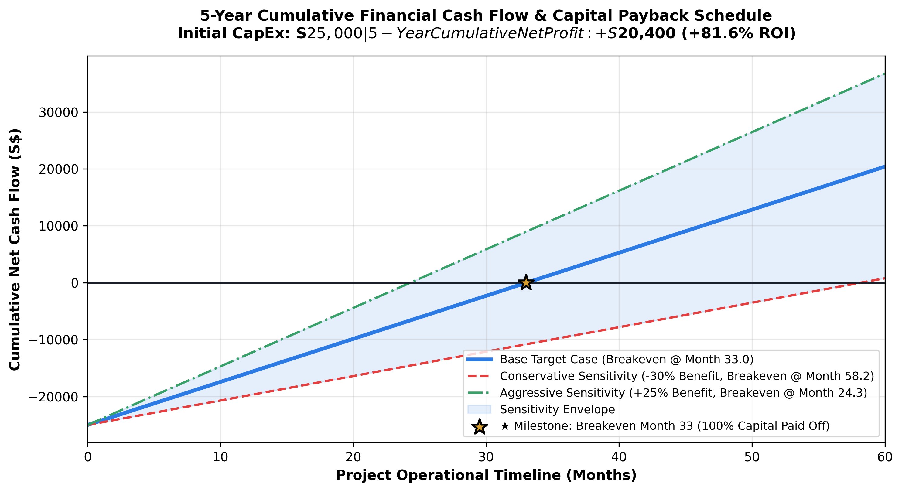

| Timeline Milestone | Cumulative Investment Outflow | Cumulative Gross Benefits | Cumulative OPEX Support | Cumulative Net Cash Flow | Financial Status |
| :--- | :---: | :---: | :---: | :---: | :--- |
| **Month 0 (Kickoff)** | -S$25,000 | S$0 | S$0 | **-S$25,000** | Initial CAPEX Outlay |
| **Month 12 (Year 1 End)**| -S$25,000 | +S$13,080 | -S$4,000 | **-S$15,920** | First-Year Net Yield -63.7% |
| **Month 24 (Year 2 End)**| -S$25,000 | +S$26,160 | -S$8,000 | **-S$6,840** | Capital 72.6% Recouped |
| **Month 33 (Breakeven ★)**| -S$25,000 | +S$36,000 | -S$11,000 | **S$0** | **100% Capital Paid Off** |
| **Month 36 (Year 3 End)**| -S$25,000 | +S$39,240 | -S$12,000 | **+S$2,240** | Net Positive Cash Flow |
| **Month 48 (Year 4 End)**| -S$25,000 | +S$52,320 | -S$16,000 | **+S$11,320** | +45.3% Net Capital ROI |
| **Month 60 (Year 5 End)**| -S$25,000 | +S$65,400 | -S$20,000 | **+S$20,400** | **+81.6% 5-Year Cumulative ROI** |

### 4.3 Sensitivity Analysis Matrix
- **Conservative Case (-30% Benefits):** Net S$5,156/year ➔ Payback **58.2 Months**, 5-Year Net Profit +S$780.
- **Base Case (Target):** Net S$9,080/year ➔ Payback **33.0 Months**, 5-Year Net Profit **+S$20,400**.
- **High Electricity Tariff (S$0.38/kWh):** Net S$9,368/year ➔ Payback **32.0 Months**, 5-Year Net Profit +S$21,840.
- **Aggressive Case (+25% Benefits):** Net S$12,350/year ➔ Payback **24.3 Months**, 5-Year Net Profit +S$36,750.

### 4.4 Physical Thermodynamic Saturation & CapEx Equipment Retrofit Advisory
When software optimization reaches the physical cooling limit of the existing equipment (>0.550 m³/s total peak demand or severe thermal deficit with clean filters):
* **`EQUIPMENT_RETROFIT_ADVISORY` Trigger:** Formulated automatically with transparent engineering metrics:

| Retrofit Option | Equipment Specification | Estimated CapEx | Energy Savings / yr | Payback Period | Ideal Use Case |
| :--- | :--- | :---: | :---: | :---: | :--- |
| **Option A: Central VAV AHU** | 0.750 m³/s EC Plug Fan AHU | ~S$12,500 | S$6,800 / yr | **1.8 Years** | Whole-wing high occupancy scaling |
| **Option B: Dedicated Split Unit** | 3.5 kW Inverter Split-Unit for Room 4 | ~S$2,800 | S$3,100 / yr | **11 Months** | Targeted relief for high-density computing loads |

### 4.5 5-Stage Phased Scalability Roadmap
1. **Stage 1 (Months 1–6) — Simulated Cyber-Physical Pilot:** Validate PID feedback, coordinator debt, and synthetic ML model in a multi-room setup.
2. **Stage 2 (Months 7–12) — Shadow Real-World Deployment:** Install physical non-intrusive sensors; run predictive models in passive observation mode.
3. **Stage 3 (Months 13–24) — Human-in-the-Loop Advisory Integration:** Enable live maintenance dispatches and candidate policy queue for facility staff sign-off.
4. **Stage 4 (Months 25–36) — Constrained Closed-Loop Automation:** Enable autonomous peak-shaving and pre-cooling with verified safety bounds (**Breakeven achieved at Month 33**).
5. **Stage 5 (Months 37–60) — Campus-Wide Federated Ecosystem:** Scale across all campus building AHUs with federated learning and campus grid load-shedding.

---

## Section 5: System Verification, Artifacts & Architecture Summary

### 5.1 Predictive Model Implementation & Executed Notebook
- **Location:** [`notebooks/fan_failure_prediction.ipynb`](file:///Users/lacle/Desktop/SUTD/DigitalTwin/GroupHW2/Simulation_Room/notebooks/fan_failure_prediction.ipynb)
- **Artifacts:** Exported scikit-learn model [`fan_risk_logistic.json`](file:///Users/lacle/Desktop/SUTD/DigitalTwin/GroupHW2/Simulation_Room/simulator/models/fan_risk_logistic.json) and validation metrics [`fan_risk_logistic.metrics.json`](file:///Users/lacle/Desktop/SUTD/DigitalTwin/GroupHW2/Simulation_Room/simulator/models/fan_risk_logistic.metrics.json).

### 5.2 Integrated Cyber-Physical Architecture Specification
- **Location:** `report/images/00_integrated_architecture.png` and [`docs/architecture.md`](file:///Users/lacle/Desktop/SUTD/DigitalTwin/GroupHW2/Simulation_Room/docs/architecture.md).

### 5.3 Executive Briefing Deck & Technical Walkthrough Scripts
- **Slide Deck:** `report/pitch/EcoHVAC_Guardian_Project2_Pitch.pptx` & `.pdf`.
- **English Demo Script:** [`report/demo_script.md`](file:///Users/lacle/Desktop/SUTD/DigitalTwin/GroupHW2/Simulation_Room/report/demo_script.md) (5:30 timed walkthrough).
- **Vietnamese Demo Script:** [`report/demo_script_vi.md`](file:///Users/lacle/Desktop/SUTD/DigitalTwin/GroupHW2/Simulation_Room/report/demo_script_vi.md) (5:30 timed walkthrough).

### 5.4 Digital Twin Core Capabilities Matrix

| Architectural Layer | Core Capability Implemented | Technical & Mathematical Verification |
| :--- | :--- | :--- |
| **Physics & Thermodynamics** | 4-Zone Smart Wing multi-room heat balance (V = 100–200 m³, C_th = 300–600 kJ/K) with sensible occupant heating (100 W/person) and equipment biases. | Continuous Euler ODE thermal integration with VAV supply plenum cooling delivery (0.480 m³/s, T_supply = 16.0°C). |
| **Predictive Intelligence** | L2-regularized standardized Logistic Regression predicting 7-day mechanical fan motor failure risk, and forward thermal trajectory forecaster (+5m, +15m). | N = 2,400 synthetic operating episodes, holdout accuracy **80.42%**, precision **74.80%**, ROC-AUC **0.8449**, Brier score **0.1467**, and 30% OOD envelope protection. |
| **Cyber-Physical Coordination** | Centralized `occupied-comfort-debt-v2` multi-zone resource allocator with anti-windup PID integral error bleed. | Deterministic lexicographic priority queue preventing student room starvation and actuator oscillation during severe AHU derating. |
| **Governance & Human Feedback** | Self-learning policy lifecycle with 4-part automated verification test suite, Human-in-the-Loop engineering sign-off form, and zero-PII privacy design. | Candidate policies require 15-tick verification (≤ 1.0°C error, < 40% risk, ≤ 250 W, ≤ 20°C·s debt) and facility engineer approval before SHA-256 promotion. |
| **Autonomous Closed-Loop** | Dual-mode control architecture (`AUTO 🤖` vs `HITL 👤`) executing verified knowledge base policies with live notification banners and toasts. | Instantaneous (< 50 ms) pattern matching against approved SQLite catalog with strict physical clamp limits (18.0°C – 30.0°C, P ≤ 250 W). |
| **Strategic ROI & Retrofit** | 5-Year cumulative financial cash flow engine, 4-tier sensitivity matrix, and automated physical saturation retrofit advisor (AHU vs Split Unit). | Initial S$25k CAPEX paid off at **Month 33 Breakeven (★)**, delivering **+S$20,400 net profit (+81.6% 5-Year ROI)**. |
| **3D Spatial Digital Twin** | Full Three.js WebGL spatial facility (`room3d.html`), dynamic holographic billboards, transparent ducts with flowing neon particles, diffuser jets, and distress beacon. | Synchronized over MQTT/WebSockets (TCP 1883 / 9001) with live occupancy, airflow, temperature color coding, and HUD toggle. |